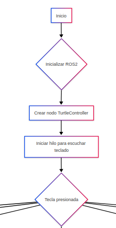
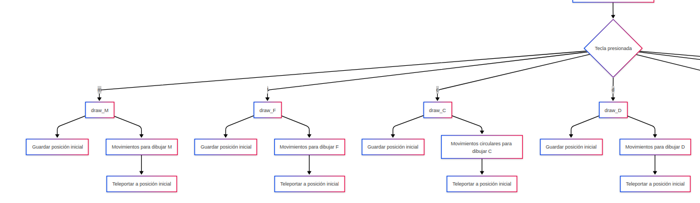
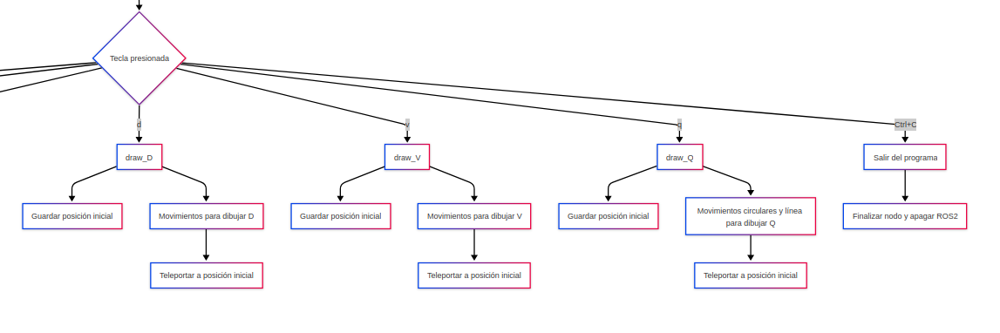
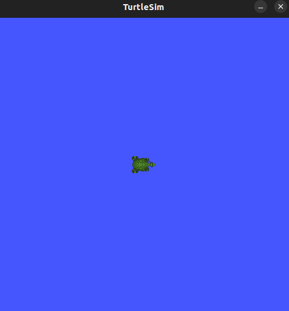

# Laboratorio No. 01
# Robótica de Desarrollo, Intro a ROS 2 Humble - Turtlesim

* David Camilo Valbuena
* Carlos Fernando Quintero Castillo
## Introducción 
## Control de movimiento manual
## Dibujo automático de letras personalizadas

Para este proceso vamos a partir del script puesto a disposición como primer ejemplo, el cual vamos modificar para cumplir con los requerimientos.

> Teniendo en cuenta nuestros nombres completos, se tiene que las letras a dibujar son D, C, V, M, F y Q

### Diagrama de flujo
<center>





</center>

### Código


#### Importamos las bibliotecas necesarias para ROS2, mensajes y servicios
```
import rclpy
from rclpy.node import Node
from geometry_msgs.msg import Twist  # Para comandos de movimiento
from turtlesim.msg import Pose  # Para obtener la posición de la tortuga
from turtlesim.srv import TeleportAbsolute  # Servicio de teletransportación
```
#### Bibliotecas para el manejo de entrada/salida y multihilo
```
import sys
import tty
import termios
import threading
import time
import math  # Para cálculos matemáticos

class TurtleController(Node):
    def __init__(self):
        # Inicializamos el nodo de ROS2 con el nombre 'turtle_controller'
        super().__init__('turtle_controller')
        
        # Creamos un publicador para enviar comandos de velocidad a la tortuga
        self.publisher_ = self.create_publisher(Twist, '/turtle1/cmd_vel', 10)
        
        # Inicializamos variables para almacenar la pose actual
        self.current_pose = None
        
        # Nos suscribimos al tópico de pose para conocer la posición/orientación actual
        self.pose_subscriber = self.create_subscription(Pose, '/turtle1/pose', self.pose_callback, 10)
        
        # Creamos un cliente para el servicio de teletransportación absoluta
        self.teleport_client = self.create_client(TeleportAbsolute, '/turtle1/teleport_absolute')
        
        # Configuramos un hilo para escuchar el teclado sin bloquear el nodo
        self.keyboard_thread = threading.Thread(target=self.keyboard_listener)
        self.keyboard_thread.daemon = True  # El hilo termina cuando el nodo se cierra
        self.keyboard_thread.start()
```
#### Funciones auxiliares
```
    def pose_callback(self, msg):
        # Actualizamos la pose actual cada vez que recibimos un mensaje
        self.current_pose = msg

    def get_key(self):
        # Implementamos lectura de teclas sin bloqueo (modo raw)
        fd = sys.stdin.fileno()
        old_settings = termios.tcgetattr(fd)
        try:
            tty.setraw(fd)
            key = sys.stdin.read(1)  # Leemos un solo carácter
        finally:
            # Restauramos la configuración original del terminal
            termios.tcsetattr(fd, termios.TCSADRAIN, old_settings)
        return key

    def keyboard_listener(self):
        # Bucle principal para detectar pulsaciones de teclas
        while rclpy.ok():
            key = self.get_key()
            # Mapeamos teclas a funciones de dibujo
            if key.lower() == 'm':
                self.get_logger().info("Dibujando letra M")
                self.draw_M()
            elif key.lower() == 'f':
                self.get_logger().info("Dibujando letra F")
                self.draw_F()
            # ... (otros casos similares para cada letra)
            elif key == '\x03':  # Detenemos con Ctrl+C
                break

    def teleport(self, x, y, theta):
        # Implementamos el servicio de teletransportación
        req = TeleportAbsolute.Request()
        req.x = x
        req.y = y
        req.theta = theta
        
        # Enviamos la solicitud de forma asíncrona
        future = self.teleport_client.call_async(req)
        
        # Esperamos máximo 2 segundos por la respuesta
        start_time = time.time()
        while not future.done() and (time.time() - start_time < 2.0):
            time.sleep(0.1)
        
        # Verificamos si el servicio respondió correctamente
        if future.done():
            try:
                future.result()
            except Exception as e:
                self.get_logger().error(f"Error al teleportar: {e}")
        else:
            self.get_logger().error("Teleport no completado a tiempo")

    def move_distance(self, distance, speed=2.0):
        # Movemos la tortuga en línea recta una distancia específica
        duration = abs(distance) / speed  # Calculamos tiempo necesario
        msg = Twist()
        msg.linear.x = speed if distance >= 0 else -speed  # Dirección
        
        # Publicamos comandos de movimiento durante el tiempo calculado
        start_time = time.time()
        while time.time() - start_time < duration:
            self.publisher_.publish(msg)
            time.sleep(0.05)  # Pequeña pausa para no saturar
        
        # Detenemos la tortuga al finalizar
        self.publisher_.publish(Twist())
        time.sleep(0.1)  # Breve espera para estabilización

    def turn_angle(self, angle, angular_speed=1.0):
        # Rotamos la tortuga un ángulo específico (radianes)
        duration = abs(angle) / angular_speed
        msg = Twist()
        msg.angular.z = angular_speed if angle >= 0 else -angular_speed
        
        # Ejecutamos la rotación durante el tiempo calculado
        start_time = time.time()
        while time.time() - start_time < duration:
            self.publisher_.publish(msg)
            time.sleep(0.05)
        
        # Detenemos el giro
        self.publisher_.publish(Twist())
        time.sleep(0.1)

    def save_initial_pose(self):
        # Guardamos la posición/orientación actual como punto de inicio
        if self.current_pose is None:
            self.get_logger().error("Pose no disponible")
            return None
        return (self.current_pose.x, self.current_pose.y, self.current_pose.theta)
```
#### Funciones para dibujar las letras
```
    def draw_C(self):
        # Dibujamos la letra C usando un arco semicircular
        initial = self.save_initial_pose()
        if not initial:
            return
        x, y, theta = initial
        
        # Parámetros del dibujo
        radius = 1.5
        angular_speed = 1.0  # Velocidad angular en rad/s
        linear_speed = angular_speed * radius  # Velocidad lineal para movimiento circular
        
        # Orientamos la tortuga y dibujamos el semicírculo
        self.turn_angle(math.radians(180))  # Apuntamos hacia la izquierda
        
        # Configuramos el movimiento circular continuo
        msg = Twist()
        msg.linear.x = linear_speed
        msg.angular.z = angular_speed  # Giro izquierdo
        
        # Ejecutamos el movimiento durante π radianes (180°)
        start_time = time.time()
        while time.time() - start_time < (math.pi / angular_speed):
            self.publisher_.publish(msg)
            time.sleep(0.05)
        
        # Finalizamos y regresamos al punto inicial
        self.publisher_.publish(Twist())
        self.teleport(x, y, theta)

    def draw_V(self):
        # Dibujamos la letra V con dos líneas diagonales
        initial = self.save_initial_pose()
        if not initial:
            return
        x, y, theta = initial
        
        # Primera diagonal (derecha)
        self.turn_angle(math.radians(60))  # Giramos 60° a la izquierda
        self.move_distance(3.0)
        self.teleport(x, y, theta)  # Regresamos al centro
        
        # Segunda diagonal (izquierda)
        self.turn_angle(math.radians(-60))  # Giramos 60° a la derecha
        self.move_distance(3.0)
        self.teleport(x, y, theta)  # Regresamos al centro
```
> Se omiten las demás letras al ser una lógica similar
#### Función principal
```
def main(args=None):
    # Función principal: inicializamos ROS2 y el nodo
    rclpy.init(args=args)
    node = TurtleController()
    try:
        # Mantenemos el nodo activo
        rclpy.spin(node)
    except KeyboardInterrupt:
        # Manejamos la interrupción por teclado
        node.get_logger().info("Interrupción por teclado")
    finally:
        # Limpieza final
        node.destroy_node()
        rclpy.shutdown()

if __name__ == '__main__':
    main()
```
### Implementación 
Para ello nos vamos a emplear la terminal del software *Terminator*, en donde vamos a abrir dos pestañas; una será la encargada de la visualización y la otra del control del simulador Turtlesim

Al ya tenerlo instalado, vamos a proceder en una de las terminales, a ejecutar el simulador Turtlesim mediante el comando *ros2 run turtlesim turtlesim_node*, mostrando una ventana como la mostrada a continuación:



Para el control de la turtuga es importante tener creado un nodo que nos permita darle las ordenes de movimiento, para ello lo haremos ejecutando los siguientes comandos:
```
cd ~/ros2_ws/src
ros2 pkg create --build-type ament_python my_turtle_controller
```
Con esto realizado, solo faltaria la creción del archivo encargado de controlar la tortuga el cual será en lenguaje de Python el cual lo ubicaremos en la ruta ```my_turtle_controller/my_turtle_controller/```, en donde se crea el archivo que llamaremos como *move_turtle.py*

Por último ejecutamos los siguientes comandos para compilar y ejecutar este nodo que hemos creado:

```
cd ~/ros2_ws
colcon build
source install/setup.bash
ros2 run my_turtle_controller move_turtle
```
