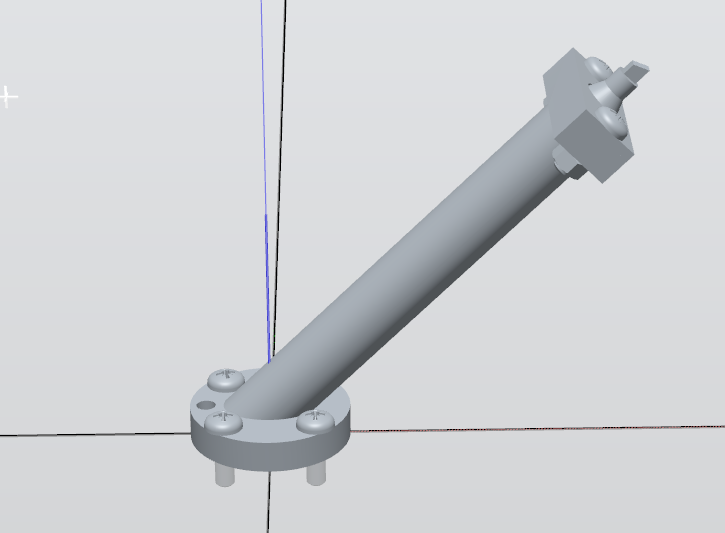
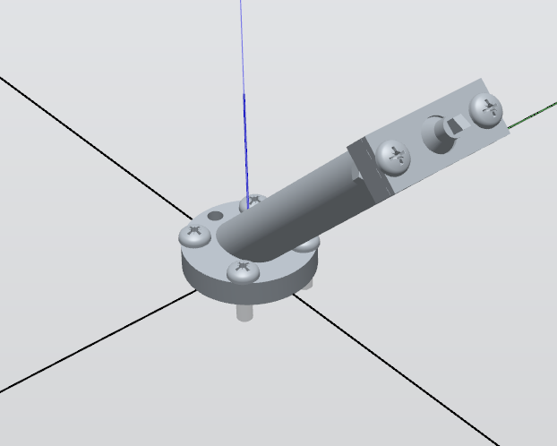
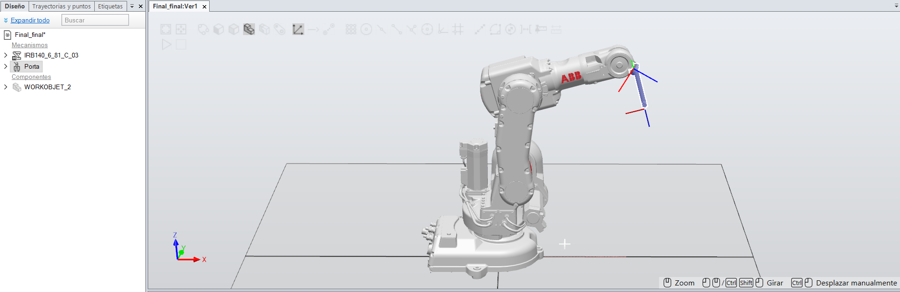
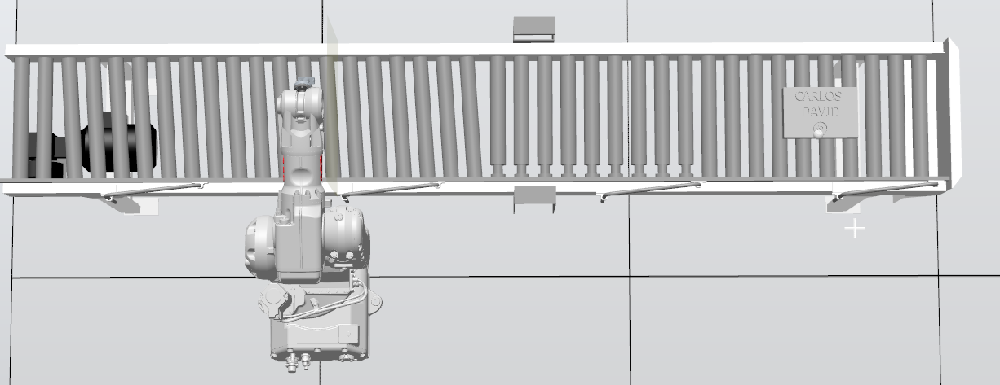
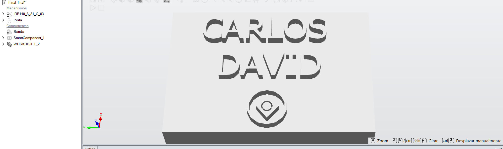
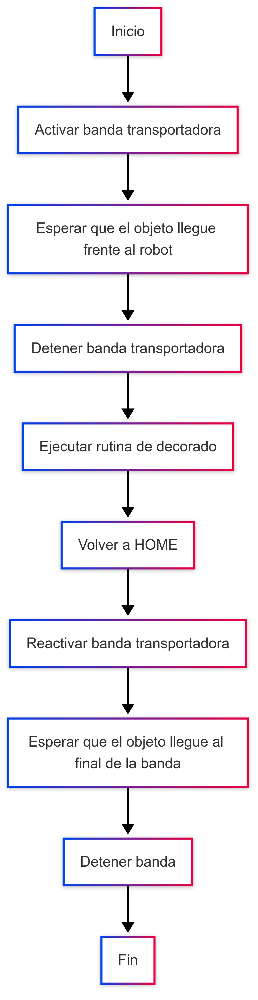

# Laboratorio No. 02
# Robótica Industrial- Trayectorias, Entradas y Salidas Digitales.

* David Camilo Valbuena Molano
* Carlos Fernando Quintero Castillo
---

## Introducción 
Este laboratorio busca poner en práctica conceptos clave de la robótica industrial, como la programación de trayectorias, el diseño de herramientas y el uso de señales digitales. A través de la simulación de la decoración de una torta con un robot ABB IRB 140, se diseñaron movimientos personalizados, calibración de la herramienta y configuración entradas y salidas digitales, integrando así programación en RAPID con tareas reales de automatización.

## Herramienta de trabajo
Se modeló la herramienta según las especificaciones del flanche en la guia de laboratorio, posteriormente se cargó al entorno de robot studio y se asigno al robot correspondiente el cual es el ABB IRB 140 se define que es una herramienta de trabajo y se procede a crear, en robot studio aparece en la ventana de diseño que es un mecanismo en este caso de nombre porta

 

 

El marco de referencia de la herramienta se modifica de tal forma que el eje z coincida con el ataque del marcador esto será especialmente útil al momento de realizar las trayectorias que nos permitirán definir nuestra decoración

## Plano de planta
Se adjunta una vista de planta de la estación en la cual se visualiza el robot, la banda transportadora y el objeto de trabajo en el que se va a hacer el decorado 

## Descripción de la solución 
En primera instancia se modela un solido de dimensiones Ancho 160mm, Largo 235mm y Alto 47.5mm, en el cual se coloca el texto que va incluir para este caso es el nombre primer nombre de los integrantes del equipo (CARLOS y DAVID) y una figura a gusto,  posteriormente se extruye para así crear las referencias que van a tener los puntos de las trayectorias en robot studio.

En este proyecto se utilizaron **tres Smart Components**:

- Uno para representar el **movimiento lineal**.  
- Dos para representar **planos de sensor**, los cuales funcionarán como **puntos de parada** o referencia durante la ejecución de las trayectorias.

Una vez importado el modelo a **RobotStudio**, se definió un **WorkObject**. Aunque técnicamente el **WorkObject** representa el plano sobre el cual se ejecutan las trayectorias, en este caso se tomó como referencia uno de los planos definidos por los sensores.

Posteriormente, se seleccionaron los puntos que conforman las trayectorias correspondientes a las **letras** y la **decoración** del diseño.

### Programación en RAPID

En el lenguaje **RAPID**, se trabaja principalmente con tres instrucciones para el diseño de trayectorias:

- `MoveL`: para trayectorias **lineales**.  
- `MoveJ`: para movimientos **directos** a un punto específico con interpolación conjunta.  
- `MoveC`: para trayectorias **curvas** entre dos puntos, pasando por un punto intermedio.

Para este proyecto, se usaron principalmente los comandos `MoveJ` y `MoveC`, con el objetivo de lograr trayectorias suaves y controladas en los distintos segmentos del diseño. El detalle de estos movimientos puede observarse con mayor claridad en el código RAPID generado.

## Diagrama de flujo de acciones del robot

Una secuencia simple de las acciones del robot es el siguiente: 

## Código en RAPID

Para este apartado se puede encontrar el código utilizado en la carpeta *"Códigos"*.

## Video explicativo
Para un mayor detalle de lo realizado, se puede ver el video de la implementación tanto simulada como física [aquí](https://youtu.be/SD21q73Zi-A)
