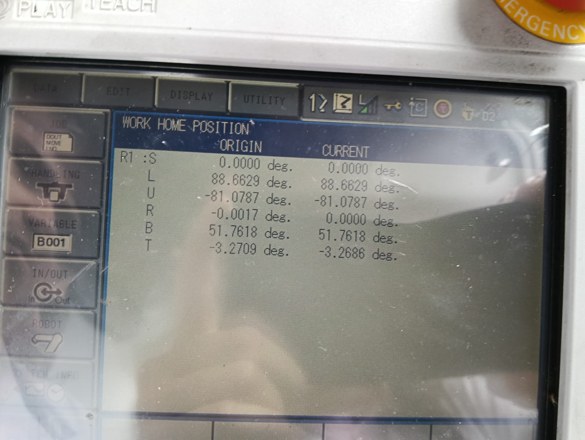
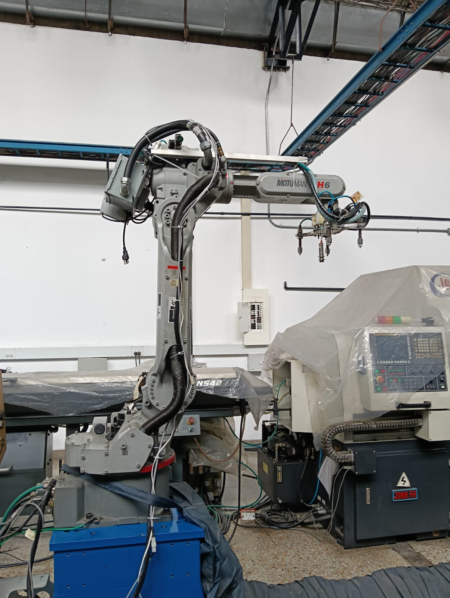
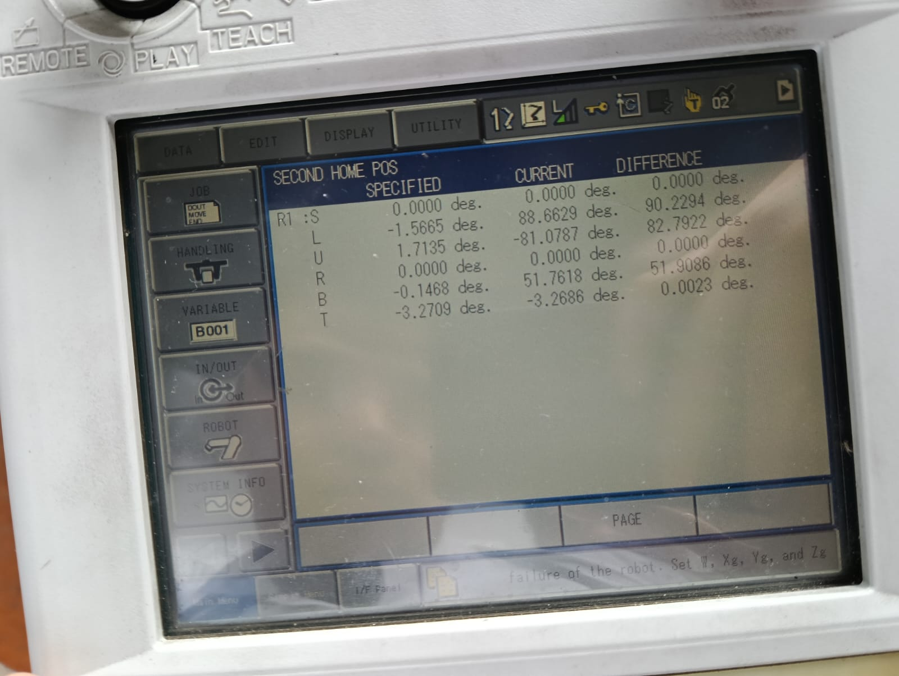
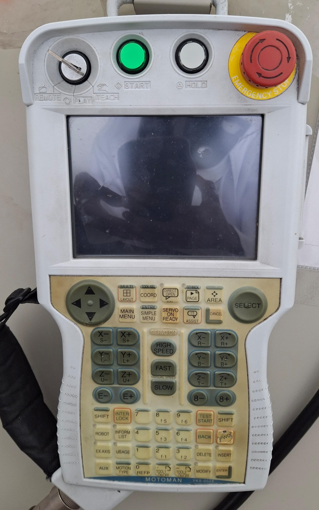

# Laboratorio No. 03
# Robótica Industrial- Análisis y Operación del Manipulador Motoman MH6.

* David Camilo Valbuena Molano
* Carlos Fernando Quintero Castillo
---

## Introducción 
Los manipuladores industriales son brazos robóticos articulados diseñados para automatizar tareas repetitivas, peligrosas o de alta precisión en entornos de manufactura, ensamblaje, soldadura, pintura y más. Em esta practica nos enfocaremos en el diseño de trayectorias polares apoyados en el software RobotDK con el objetivo de sentar las bases teóricas y prácticas para la programación offline, simulación y puesta en marcha de movimientos tanto virtuales como reales. Con ello podemos establecer criterios compartivos tanto en los entornos (RoboDK y RobotStudio) como en los manipuladores ­–el Yaskawa Motoman MH6 y el ABB IRB 140– con el fin de concretar las principales fortalezas y aplicaciones de cada herramienta.

---
## Comparación técnica entre el Motoman MH6 y el IRB140

| Característica               | Motoman MH6                          | ABB IRB 140                         |
|------------------------------|--------------------------------------|-------------------------------------|
| Carga máxima                 | 6 kg                                 | 6 kg                                |
| Alcance máximo               | 1422 mm                               | 810 mm                              |
| Grados de libertad (DoF)     | 8 ejes                               | 6 ejes                              |
| Velocidad máxima lineal      | Variable según eje                           | Variable según eje                          |
| Repetibilidad                | ± 0.08 mm mm                            | ± 0,03 mm                           |
| Peso del manipulador         | 130 kg                                | 95 kg                              |
| Controlador | DX100 | IRC5 |
| Aplicaciones típicas         | Pick & place de componentes ligeros, embalaje, inspección | Montajes de ensamblaje pequeños, pick & place, handling, Drawing          |

> [!NOTE] 
> - Aunque ambos comparten 6 kg de carga, el IRB 140 ofrece mayor alcance y velocidad lineal, a costa de un peso mucho mayor.
> - El MH6 es más compacto y ligero, ideal en estaciones de mesas de trabajo con limitación de espacio.  

---

##  Descripción de las configuraciones home1 y home2

El Motoman MH6 tiene dos posiciones iniciales de referencia definidas: Home1 (Home Position) y Home2 (Second Home).

### home1

- **Posición:**

- **Coordenadas:**

### home2
- **Posición:**

- **Coordenadas:**
  

---

## Control Manual del Manipulador: Movimiento Articular y Cartesiano

El **DX100 Teach Pendant** del MH6 permite mover el robot manualmente en diferentes modalidades. En modo articulación (Joint) cada eje del robot se controla individualmente. El pendient tiene teclas dedicadas a cada articulación: por ejemplo, los botones etiquetados **S+ / S-** controlan **J1** (giro en la base), **L+ / L**- controlan **J2** (inclinación del hombro), **U+ / U- J3** (codo), **R+ / R- J4**, **B+ / B- J5**, y **T+ / T- J6**. Al mantener pulsados esos botones (o su equivalente en la pantalla) el robot gira cada eje hacia adelante (+) o atrás (–). Esto permite mover el brazo “articulación por articulación” para posicionarlo. En modo cartesiano (X-Y) los movimientos se definen en coordenadas lineales del espacio o en el sistema de la herramienta. Es decir, los ejes XYZ corresponden a traslaciones del extremo (end-effector) en X, Y y Z, y hay modos adicionales para rotaciones alrededor de X, Y, Z del efector. Se cambia entre modo articulado y cartesiano usando el selector de modo del teach pendant.

---
## Niveles de velocidad del Motoman

El control **DX100 del MH6** permite ajustar la velocidad manual en que se mueven los ejes. Hay 3 niveles definidos: Low (bajo), Medium (medio) y High (alto). Estos niveles se seleccionan con las teclas de velocidad en el teach pendant (etiquetadas como SLOW, FAST y High Spped). El operador puede, por ejemplo, presionar “FAST” para aumentar un nivel o “SLOW” para disminuirlo.

---

## Descripción de las principales funcionalidades de RoboDK

RoboDK es un software de simulación y programación offline de robots muy utilizado. Entre sus principales funcionalidades se incluyen:

- **Programación Offline**  
  - Importa modelos CAD (STEP, IGES) y crea trayectorias sin interrumpir la producción.  
- **Simulación 3D**  
  - Visualiza el movimiento del robot en entorno virtual, detecta colisiones y valida alcances.  
- **Post-procesadores**  
  - Genera código específico para controladores de distintos fabricantes (Yaskawa, ABB, Fanuc…).  
- **Calibración y Escaneo**  
  - Permite calibrar robots y herramientas usando protocolos estándar (TCP, WObj).  
- **API y Automatización**  
  - Scripting en Python para personalizar rutinas, loops, condiciones y conectarse a PLCs o bases de datos.  
- **Integración CAM/CAD**  
  - Conecta camadas de mecanizado (mill, laser, corte por chorro) directamente con el robot.  

## Comunicación con el Manipulador Motoman

**Protocolo de Comunicación:**

- RoboDK establece comunicación con el manipulador Motoman mediante múltiples protocolos:

- Ethernet/IP Industrial: Comunicación estándar para transferencia de programas y datos
- Socket TCP/IP: Para control en tiempo real y monitoreo de estado
- FTP: Transferencia de archivos de programa al controlador DX100
- Modbus TCP: Para lectura/escritura de variables de proceso

**Proceso de Ejecución de Movimientos:**

- Generación de Trayectoria: RoboDK calcula la trayectoria óptima considerando restricciones cinemáticas y dinámicas
- Conversión de Código: El programa se convierte al lenguaje nativo del controlador (INFORM para Motoman)
- Validación Previa: Verificación de límites articulares y detección de singularidades
- Transferencia: Envío del programa al controlador DX100 via red
- Ejecución Controlada: Monitoreo en tiempo real del progreso y estado del robot
- Retroalimentación: Recepción de datos de posición actual y estado de ejecución

**Funciones Específicas para Motoman:**

- Driver Motoman: Módulo especializado para comunicación con controladores DX100
- Sincronización: Coordinación precisa entre simulación y robot físico
- Manejo de Variables: Gestión de variables de proceso y señales I/O
- Gestión de Programas: Administración remota de programas almacenados en el controlador

---
## Análisis comparativo entre RoboDK y RobotStudio

| Aspecto | RoboDK | RobotStudio |
|---------|---------|-------------|
| **Compatibilidad de Marcas** | Universal (250+ fabricantes) | Específico para ABB |
| **Entorno de Desarrollo** | Multiplataforma (Windows, Mac, Linux) | Windows exclusivamente |
| **Lenguajes de Programación** | Python, C++, MATLAB, LabVIEW | RAPID nativo |
| **Simulación Física** | Avanzada con múltiples motores | Altamente optimizada para ABB |
| **Costo de Licenciamiento** | Modelo por usuario/funcionalidad | Incluido con robots ABB |
| **Curva de Aprendizaje** | Moderada, interfaz intuitiva | Empinada, altamente especializada |
| **Capacidades de CAD** | Importación universal | Integración nativa con PowerPacs |

---
## Código en Python

Para este apartado se puede encontrar el código utilizado en la carpeta *"Códigos"*.

## Video explicativo
Para un mayor detalle de lo realizado, se puede ver el video de la implementación física [aquí](https://youtu.be/5WKLtGd51os)
