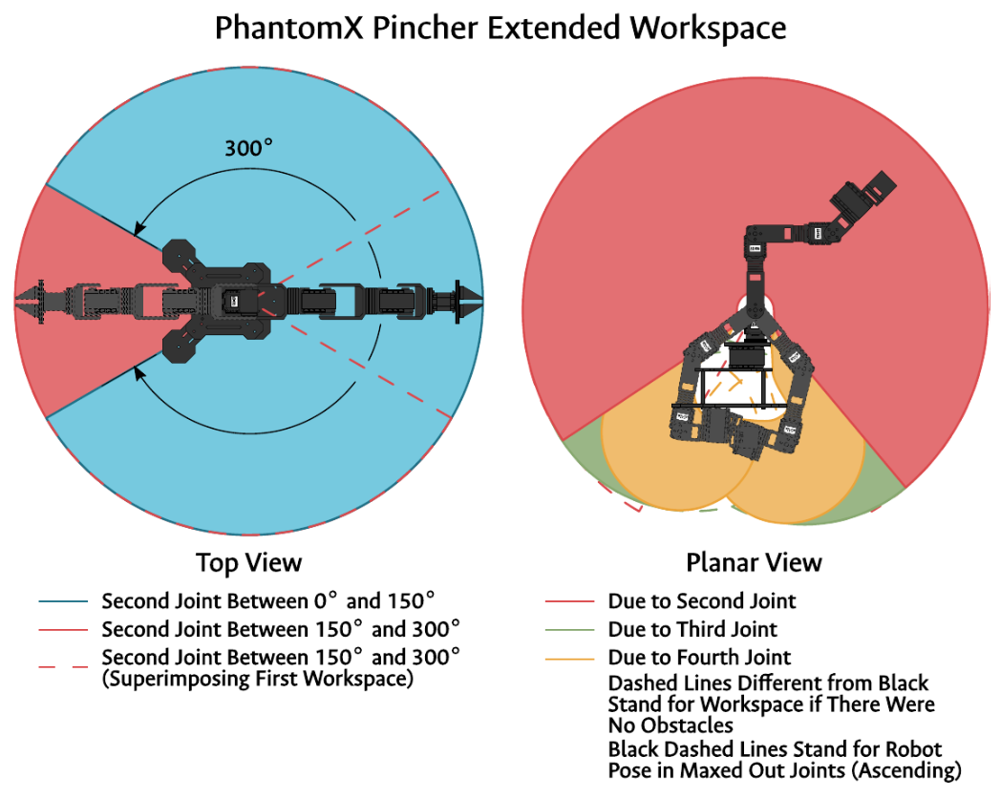

# Laboratorio No. 04
# Robótica de Desarrollo, Cinemática Directa - Phantom X- ROS

* David Camilo Valbuena Molano
* Carlos Fernando Quintero Castillo
---

## Introducción 
El presente laboratorio tiene como objetivo implementar la cinemática directa del manipulador Phantom X Pincher utilizando herramientas de programación en Python y el framework ROS 2. La práctica se centra en la configuración y control de los servomotores Dynamixel AX-12 mediante joint controllers y tópicos de ROS, así como la visualización y verificación de movimientos articulares a través de una interfaz gráfica de usuario. Este proyecto combina la robótica física con la representación gráfica, permitiendo al estudiante consolidar conocimientos sobre modelado cinemático, control en tiempo real y desarrollo de interfaces HMI.

## Cinemática directa del Phantom X Pincher

A continuación se presenta la tabla de parametros DH del robot 

El código de MATLAB usado para representar el robot con la herramienta rvc de Peter Corke se encuentra en la carpeta *"Códigos"*. como mdl_phantomx.m
Cabe aclarar que en la articulación 2 el 0 es con el robot inclinado horizontal y no completamente vertical (HOME) y que para recrear las posiciones se tuvo en cuenta este detalle y funciona bien

Posición 1
1. 0, 0, 0, 0, 0.
   

Posición 2
2. 25, 25, 20, -20, 0.

Posición 3
3. -35,35, -30, 30, 0.

Posición 4
4. 85, -20, 55, 25, 0.

Posición 5

5. 80, -35, 55, -45, 0.

## Descripción detallada de la solución planteada.

La solución planteada para este laboratorio se divide en dos componentes principales: el control de los servomotores del manipulador Phantom X Pincher y la interfaz gráfica de usuario (GUI) para la interacción con el robot. 

1. **Control de articulaciones vía ROS 2**  
   Se implementaron scripts en Python que utilizan el framework ROS 2 para enviar comandos a los servomotores Dynamixel AX-12A. El script `control_servo.py` configura los parámetros de comunicación con los motores, como el puerto, la velocidad de transmisión y los identificadores de los servos. Además, permite enviar posiciones objetivo a los motores y leer sus posiciones actuales para verificar el estado del robot.  
   - Los comandos de posición se envían a través de registros específicos de los servos, como `ADDR_GOAL_POSITION` y `ADDR_MOVING_SPEED`.  
   - Se implementa un método para cambiar dinámicamente las posiciones objetivo (`cambioPos`) y otro para apagar los motores al finalizar (`terminar`).

2. **Interfaz gráfica de usuario (GUI)**  
   La GUI, desarrollada con la biblioteca `customtkinter`, permite al usuario interactuar con el robot de manera intuitiva. El script `pincher_gui1.py` incluye:
   - Botones para mover el robot a posiciones predefinidas.
   - Un campo de entrada para enviar posiciones personalizadas.
   - Una sección que muestra en tiempo real las posiciones actuales de los servos.
   - Indicadores visuales del estado del robot y mensajes de error en caso de entradas inválidas.

3. **Integración y flujo de trabajo**  
   El flujo de trabajo comienza con la inicialización del nodo ROS 2 y la configuración de los parámetros de los servos. La GUI permite al usuario enviar comandos al robot, que son procesados por el controlador para mover los servos a las posiciones deseadas. Finalmente, se apagan los motores y se cierra la comunicación de manera segura.

## Diagrama de flujo de acciones del robot usando la herramienta Mermaid

## Plano de planta de la ubicación de cada uno de los elementos.

Se presenta el plano de planta de lo selementos y unas vistas que detalllan más información del robot 

## Descripción de las funciones utilizadas.

### Archivo `control_servo.py`
1. **`__init__`**  
   Inicializa el nodo ROS 2 y configura los parámetros de comunicación con los servos, como el puerto, la velocidad de transmisión, los identificadores de los servos y las posiciones objetivo.

2. **`terminar`**  
   Apaga el torque de todos los servos y cierra el puerto de comunicación. También finaliza el nodo ROS 2.

3. **`cambioPos`**  
   Cambia dinámicamente las posiciones objetivo de los servos. Valida que la nueva lista de posiciones tenga la misma longitud que la lista de identificadores de los servos.

4. **`deg2pwm`**  
   Convierte un ángulo en grados a un valor PWM compatible con los servos Dynamixel.

5. **`main`**  
   Define posiciones predefinidas y permite probar el movimiento del robot mediante comandos directos.

---

### Archivo `pincher_gui1.py`
1. **`actualizar_posicion`**  
   Actualiza en tiempo real las posiciones actuales de los servos en la GUI. Utiliza un hilo separado para evitar bloquear la interfaz.

2. **`mover_a`**  
   Envía comandos al controlador para mover el robot a una posición específica. Deshabilita los botones de la GUI durante el movimiento para evitar conflictos.

3. **`enviar_personalizado`**  
   Valida y envía una posición personalizada ingresada por el usuario en la GUI. Muestra mensajes de error si los valores son inválidos.

4. **`cerrar`**  
   Finaliza de manera segura la ejecución de la GUI, deteniendo los hilos y apagando los motores.

## Código del script utilizado para el desarrollo de la práctica.

Para este apartado se puede encontrar el código utilizado en la carpeta *"Códigos"*.

## Video explicativo (alcanzando cada posición solicitada y del uso de la interfaz de usuario)
Para un mayor detalle de lo realizado, se puede ver el video de la implementación física [aquí](https://youtu.be/ikBTmwfwE-c)
