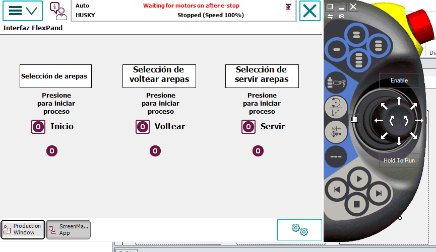
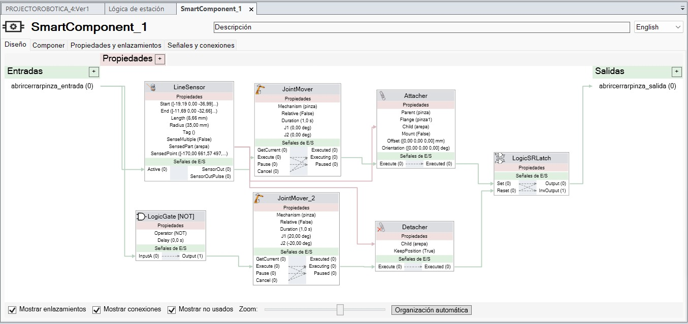
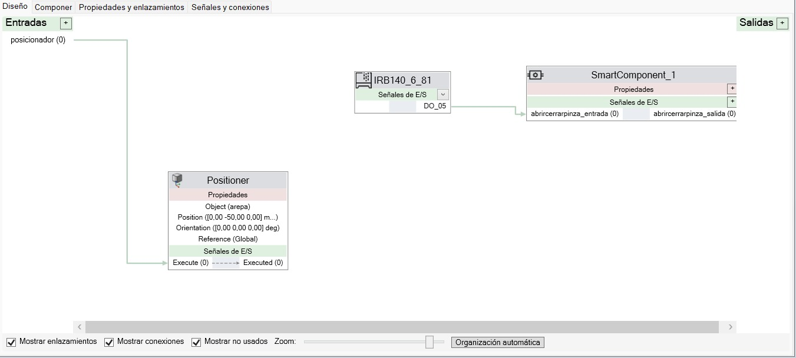

# Proyecto Final - Robótica Industrial
# Automatización del Proceso de Preparación de Arepas

* David Camilo Valbuena Molano
* Juliana Gongora Rasmussen
* Gerhaldine Alejandra Suárez Bernal
* Carlos Fernando Quintero Castillo
---
## Introducción
El presente proyecto final de robótica industrial se enfoca en automatizar el proceso de preparación de arepas —tradicionalmente manual— mediante un sistema robotizado que garantice una cocción uniforme y precisa de cada unidad. El sistema integra además sistemas electro-neumáticos para el accionamiento del gripper, garantizando control preciso durante todo el proceso. Para la interacción con el operador se implementa una interfaz humano-máquina (HMI) gráfica en el FlexPendant mediante ScreenMaker de RobotStudio, que permite seleccionar la arepa deseada y reportar el estado del proceso. A su vez, se emplea el software de simulación RobotStudio para modelar y probar virtualmente el sistema completo, facilitando las etapas de diseño y validación sin riesgo físico.

## Descripción de la solución creada

### 1. Planeación y asignación de tareas
  • Reunión inicial para definir objetivos y alcance.  
  • Asignación de roles:  
    - Investigación de actuadores y componentes neumáticos  
    - Diseño CAD del gripper  
    - Selección de mangueras, acoples y accesorios hidráulicos  
    - Integración con RobotStudio
    - HMI FlexPendant 
### 2. Selección de componentes principales
- **Actuador neumático**  
  - Se eligió una pinza neumática (marca Mindman, modelo MCHA-20) por su precisión en el posicionamiento, facil acople y adaptabilidad al reto propuesto.
- **Sistema de agarre (gripper)**  
  - Bocetos iniciales realizados en Autodesk Inventor.  
  - Material: Plastico impreso en PLA por facilidad, alcance y adaptabilidad al actuador.  
- **Mangueras y acoples**  
  - Manguera poliuretano 1/4″ (ID) resistente a 8 bar.  
  - Conectores rápidos SMC en latón con rosca BSP 1/8″ para facilitar el montaje y mantenimiento.  
### 3. Diseño y pruebas del gripper
- **Modelado CAD y simulación**  
  - Conjunto 3D del gripper en Autodesk Inventor, validación de interferencias.  
  - Integración virtual en RobotStudio junto al robot ABB IRB 120.  

### 4. Montaje físico y puesta en marcha
- Fabricación del gripper en impresora 3D.  
- Instalación de mangueras, acoples y válvulas.  
- Conexionado neumático y cableado de sensores y válvulas a la estación de control.  
- Configuración de programa RAPID en RobotStudio y ScreenMaker en el FlexPendant.
### 5. Herramientas y recursos utilizados
- Software  
  - RobotStudio 2024 SP1  
  - Autodesk Inventor 2025   
- Equipos de taller  
  - Impresora 3D Ultimaker S3  
  - Banco de pruebas neumático con manómetro y depósito de aire comprimido  
- Piezas y consumibles  
  - Pinza neumática Mindman MCHA-20 
  - Manguera poliuretano 1/4″ y conectores rápidos SMC  
  - Válvulas solenoides SMC SY5120   
  - Tornillería M5 y perfiles de aluminio 20×20 mm

##  Diagrama de flujo de las acciones del robot

  

##  Descripción, planos y fotografías del gripper diseñado y sus piezas 
Este gripper fue diseñado para manipular arepas dentro de un sistema automatizado, pensando en recogerlas con cuidado y permitir su volteo en el proceso. Está adaptado para acoplarse al robot ABB y funcionar con una pinza neumática MCHA-20, que activa el movimiento de los dedos.

El diseño tiene una forma semicircular que ayuda a guiar la arepa al centro, facilitando tanto el agarre como el giro. También incluye una base tipo espátula que permite deslizarse por debajo sin dañar el producto.

### Piezas diseñadas
- **Dedos de agarre adaptadores:**  Extensiones que se conectan a la pinza MCHA-20 y transmiten el movimiento hacia la estructura del gripper.

- **Estructura semicircular de guía:**  Dos paredes curvas que centran la arepa y la sostienen durante el agarre y traslado.

- **Base inferior:** Superficie plana que entra por debajo de la arepa para facilitar la recolección y volteo.

- **Soporte de unión al robot:** Pieza que permite acoplar el gripper al flange del brazo robótico.

### Imágenes del diseño
#### Gripper

  
 

 **Soporte**

  

 **Gripper y soporte impreso**
 

 
   

### Planos

Los siguientes archivos PDF contienen los planos detallados de las piezas modeladas:

- [Plano del adaptador](./Planos/Plano%20Adaptador.pdf)  
- [Plano del gripper](./Planos/Plano%20Gripper.pdf)

## Códigos

Para este apartado se puede encontrar el código utilizado en la carpeta *"Códigos"*.

### Explicación de implementación RAPID

El programa RAPID desarrollado para este proyecto consta de varios procedimientos que controlan las acciones del robot ABB IRB 120. A continuación, se describen los principales aspectos de la implementación:

1. **Definición de datos y configuraciones iniciales:**
   * Se definen las posiciones clave del robot mediante constantes `robtarget`, como `home`, `precogida`, `cogida`, `precocina`, entre otras. Estas posiciones representan los puntos de inicio, recogida, cocción y entrega de las arepas.
   * Se configura la herramienta utilizada (`tooldata pinza1`) y el objeto de trabajo (`wobjdata woarepa`).

2. **Estructura del programa principal:**
   * El procedimiento `main` actúa como punto de entrada y coordina las acciones principales: recoger y dejar la arepa en la estufa (`recogerydejarestufa`), voltear la arepa (`voltear`) y finalizar el proceso (`fincocinaydejado`).

3. **Procedimientos específicos:**
   * **`recogerydejarestufa`:**
     * El robot se mueve desde la posición `home` hasta `cogida` para recoger la arepa, activando la pinza neumática para sujetarla.
     * Luego, transporta la arepa a la posición de cocción (`cocina`) y la suelta.
   * **`voltear`:**
     * Este procedimiento permite voltear la arepa para garantizar una cocción uniforme. El robot recoge la arepa, realiza un movimiento de volteo en las posiciones `precocina_2_volteado` y `cocina_2_volteado`, y la suelta nuevamente.
   * **`fincocinaydejado`:**
     * Finaliza el proceso recogiendo la arepa cocida y llevándola a la posición de entrega (`dejada`).

4. **Control de la pinza neumática:**
   * Se utilizan señales digitales (`Set` y `Reset`) para controlar la apertura y cierre de la pinza neumática, asegurando un manejo preciso de las arepas durante todo el proceso.

5. **Movimientos del robot:**
   * Los movimientos se realizan mediante instrucciones `MoveJ` con velocidades y configuraciones específicas para garantizar precisión y seguridad.

Este programa fue diseñado y probado en RobotStudio, asegurando su correcto funcionamiento antes de la implementación física.

## Implementación de HMI, SmartComponent y Entradas y Salidas Digitales

### HMI (Interfaz Humano-Máquina)

La HMI fue diseñada utilizando ScreenMaker en RobotStudio para facilitar la interacción del operador con el sistema. Esta interfaz permite seleccionar el tipo de arepa deseada, iniciar el proceso y monitorear el estado del sistema en tiempo real.

### SmartComponent

Se utilizó un SmartComponent en RobotStudio para simular el comportamiento del sistema neumático y las señales digitales. Este componente permite validar la lógica de control antes de la implementación física, asegurando que las señales y movimientos sean correctos.

### Entradas y Salidas Digitales

El sistema emplea señales digitales para controlar las válvulas solenoides y sensores del sistema neumático. Estas señales se configuran en RobotStudio y se conectan al controlador del robot ABB IRB 120.

## Video explicativo

Para un mayor detalle de lo realizado, se puede ver el video de la implementación física [aquí](https://youtu.be/5WKLtGd51os)
